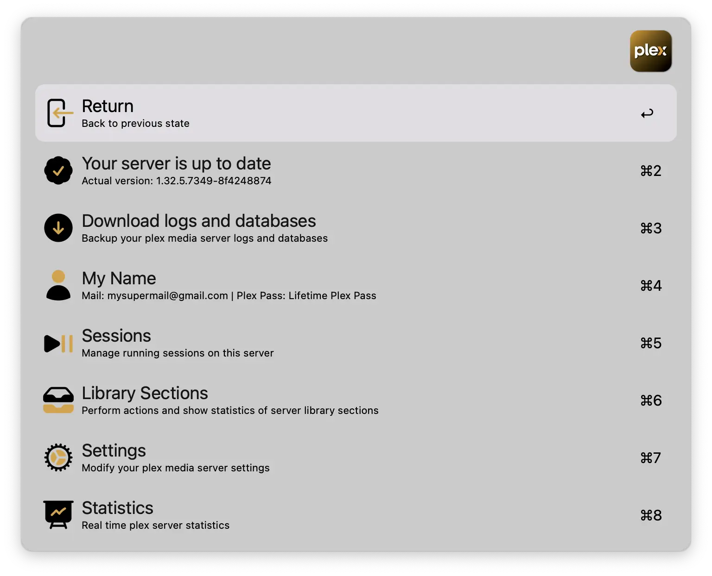
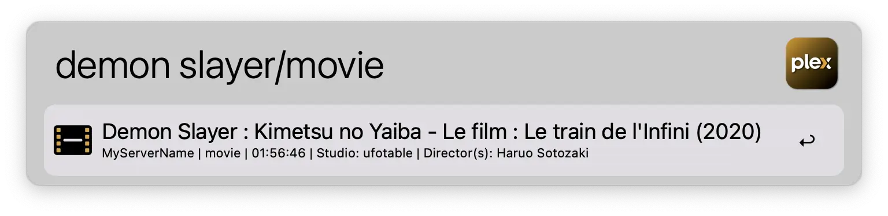
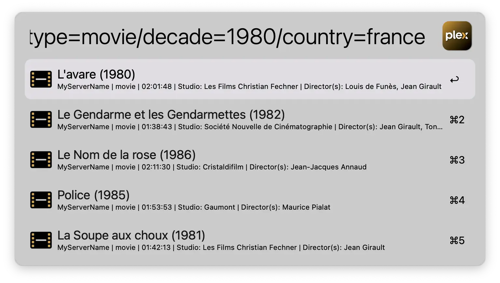
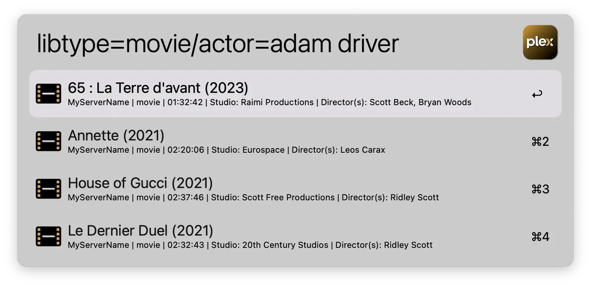
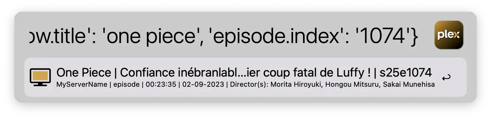
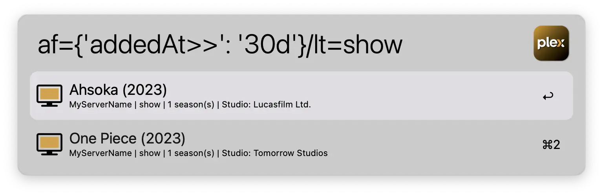
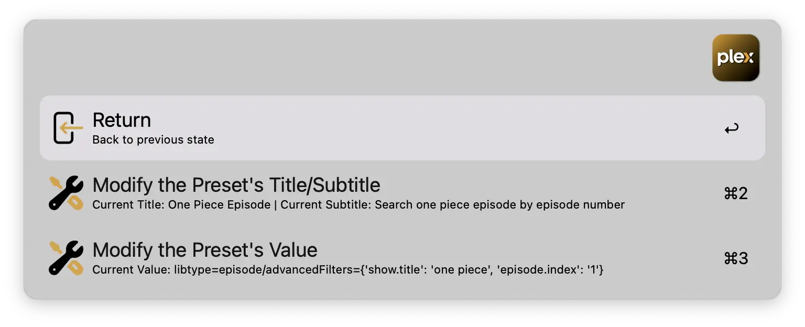
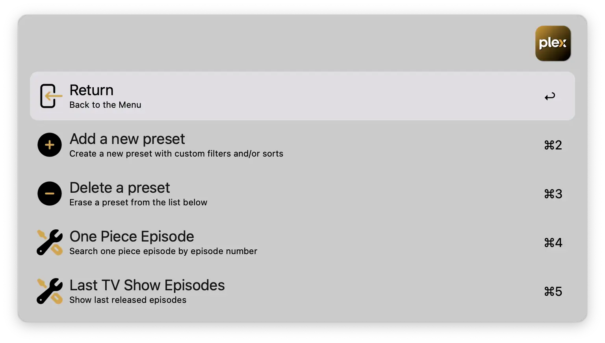

[](https://github.com/BenjaminOddou)
[](https://saythanks.io/to/BenjaminOddou)
[](https://www.python.org/downloads/macos/)

✨ Welcome to the Alfred Plex repository: **An Alfred Workflow** ✨


## ✅ Prerequisites

* MacOS.
* Alfred 5. Note that the [Alfred Powerpack](https://www.alfredapp.com/powerpack/) is required to use workflows.
* An access to a plex media server.
* Requires **python 3.7** or above.

## ⬇️ Installation

1. [Download the workflow](https://github.com/BenjaminOddou/alfred-plex/releases/latest).
2. Double click the `.alfredworkflow` file to install.

## 🏎️ Plex API

This workflow uses the [Python-PlexAPI](https://github.com/pkkid/python-plexapi) but doesn't cover all capabilities of this tool. If you see a good feature from the Python-PlexAPI that can be incorporated in this workflow, please let me know by opening an issue or sending a pull request.

## 🧰 Setup the workflow

Install Python 3.7 or above. Check your version with:

```shell
python --version
```

## 🧙‍♂️ Invoke the workflow

The workflow is divided in 5 parts :

1. `cplex`: Manage servers and perform actions (scan libraries, modify settings, backup logs and databases...).
2. `splex`: Search medias throughout your servers.
3. `dplex`: Search medias on discover.
4. `hplex`: Filtering & sorting options of your plex media server(s).
5. `pplex`: Manage presets to rapidly search medias.

You can edit these triggers (flagged with a `🕹️` symbol) in the user configuration panel.

## 🤖 Usage of the workflow

### Manage servers and perform actions

> Use `cplex` to trigger this flow.

Quickly add a server by accessing any XML page from the API, copy the URL and paste it in the Alfred search bar. To display the XML page, you'll need to:
1. Sign in to your Plex account in Plex Web App.
2. Browse to a library item and click `View XML` button.

Follow the [Plex Documentation](https://support.plex.tv/articles/201998867-investigate-media-information-and-formats/) to for more details.

If you don't have the `View XML` button on the plex client, try to open the browser's dev tool by pressing ⌥⌘i and copy the link containing the `X-Plex-Token`.

Select the server to view its informations and perform actions.
* Download last version of plex media server from the web.
* Backup logs and databases.
* Display connected accounts.
* Display connected devices (keeps history of devices).
* Display running sessions.
* Perform actions on library sections:
  * Scan library sections (search for new medias).
  * Refresh library sections (download fresh media info from the internet).
  * Display history.
  * Display library sections sizes.
* Display and modify settings of the server.

> New values for settings must match the setting type and must be valid python. For example, boolean must be True or False with capital letter and string must be quoted.



### Search medias throughout your servers

> Use `splex` to trigger this flow.

#### 1. Simple search

In this mode, you search medias on your servers directly by typing your request. You can optionally add a `/` followed by one of the following media types: *track, album, artist, collection, actor, director, genre, movie, photo, photoalbum, playlist, show, episode, clip*.

Link to the [Python-PlexAPI documentation](https://python-plexapi.readthedocs.io/en/latest/modules/server.html#plexapi.server.PlexServer.search).



#### 2. Advance search

In this mode, you search medias on your library sections. To enter this mode, you can use `filters` and/or `advanced filters`. 

To know how to use them, go to the next section (`Filtering & sorting options of your plex media server(s)`)

Link to the [Python-PlexAPI documentation](https://python-plexapi.readthedocs.io/en/latest/modules/library.html#plexapi.library.LibrarySection.search).

The following example returns `movies` released between `1980` and `1990` in the country `France`.



#### 3. Actions on medias

> The following actions can be configured in the user configuration panel

1. Nested search. Press ⏎ on one of the following media types: *actor, director, collection, artist, album, genre, show, season*, to trigger a nested search.
2. Open the media on the web. Simply press ⌘⏎ to open the media on plex. Not available for *genre, actor, director* media types.
3. Stream the media with VLC. This is only available for the following media types: *movie, episode, clip, track, album*. Press ⌥⏎ to open the media in VLC. *It requires VLC 3.0 or above and the vlc cli. See below to know how to install the cli*. If you have multiple versions of the same *movie, episode, clip*, you'll be asked to choose the file you want to play.
4. Get infos of movies and tv shows using the [Movie and TV Show Search](https://github.com/tmcknight/Movie-and-TV-Show-Search-Alfred-Workflow) Alfred workflow by [Tom McKnight](https://github.com/tmcknight). Press ⌃⏎ to trigger the workflow. *It requires `Movie and TV Show Search` Alfred workflow 2.16.0 or above*. Only available for *movie, show* media types.

#### 4. VLC integration

If you don't have VLC on your mac, run the following command to install it via homebrew:

```shell
brew install --cask vlc
```

If you already have VLC installed check the presence of the cli with:

```shell
which vlc
```

If it is not found, uninstall VLC and reinstall it using homebrew.

Link to the [homebrew formulae](https://formulae.brew.sh/cask/vlc).

### Search medias on discover

> Use `dplex` to trigger this flow.

Configure the language in the configuration panel and search medias on discover. You can perform the same actions ** as in the `splex` workflow (see above)

** Except streaming with VLC. Note that nested search allows you to search media title within your servers.


### Filtering & sorting options of your plex media server(s)

> Use `hplex` to trigger this flow.

Filters, fields and sorts options are generated based on your libraries metadata. This will vary regarding your medias and agents used to gather information. 

#### 1. Filters

> Filters can be aliased, see section `4. Aliases` below

Plex filters can be applied by typing `filterName=value`. Use `/` to separate them. Find the list of filters under each library sections of your servers.

Example: `libtype=movie/actor=834`. It returns `movies` with `Adam Driver`.



#### 2. Fields (advanced filters)

Plex fields (or advanced filters) can be applied by typing `advancedFilters={<FILTER>}` (or `af={<FILTER>}` in `alias mode`). There is certain conditions you have to respect to make advance filters working:

* Use `/` to separate advanced filter from other filters.
* You must use them along with a `libtype`.
* You must provide a valid Python *dict* or valid *JSON* syntax. Double quotes `"` and single quotes `'` are valid.

To know more on how to use these filters, check the [Python-PlexAPI documentation](https://python-plexapi.readthedocs.io/en/latest/modules/library.html#plexapi.library.LibrarySection.search).

Find the list of fields under each library sections of your servers.

Example:  `libtype=episode/advancedFilters={'show.title': 'one piece', 'episode.index': '1'}`. It returns `episodes` where `episode number` is `1` and the title of the show contains `one piece`.



#### 3. Sorts

You can sort results by typing `sort=sortName:dir` (or `so=sortName:dir` in `alias mode`). Direction can be `:asc` for ascending or `:desc` for descending.

Example: `libtype=movie/sort=originallyAvailableAt:desc`. This will display `movies` from the `most recent` to the `older` one.


#### 4. Aliases

Aliases are enabled by default, and allows you, when activated, to write filters more easily. `libtype` becomes `lt`, `studio` becomes `st`...

You can disable this behavior in the user control panel by unticking the `📜 Use aliases` parameter.

Aliases file can be edited, but be careful about double values. It is the `aliases.json` file located under the `📁 Data folder` (`~/Library/Application Support/Alfred/Workflow Data/com.benjamino.plex` by default).

Example: `af={'addedAt>>': '30d'}/lt=movie`. It returns `movies` added in plex during the last `30 days`.



### Manage presets to rapidly search medias

> Use `pplex` to trigger this flow.

#### 1. Create a preset

Create easily preset by pressing ⏎ on `Add a new Preset`. Input a `value` for the preset **WITH FULL FILTERS NAMES**. Then input a `title` and a `subtitle` separated by a `/`.

#### 2. Modify a preset

Simply press ⌘⏎ to enter in the modified mode. Press ⏎ to edit the `title/subtitle` or the `value`.



#### 3. Apply a preset

Simply press ⏎ on a preset to apply its value to the search workflow.



## ⚖️ License

[MIT License](LICENSE) © Benjamin Oddou
